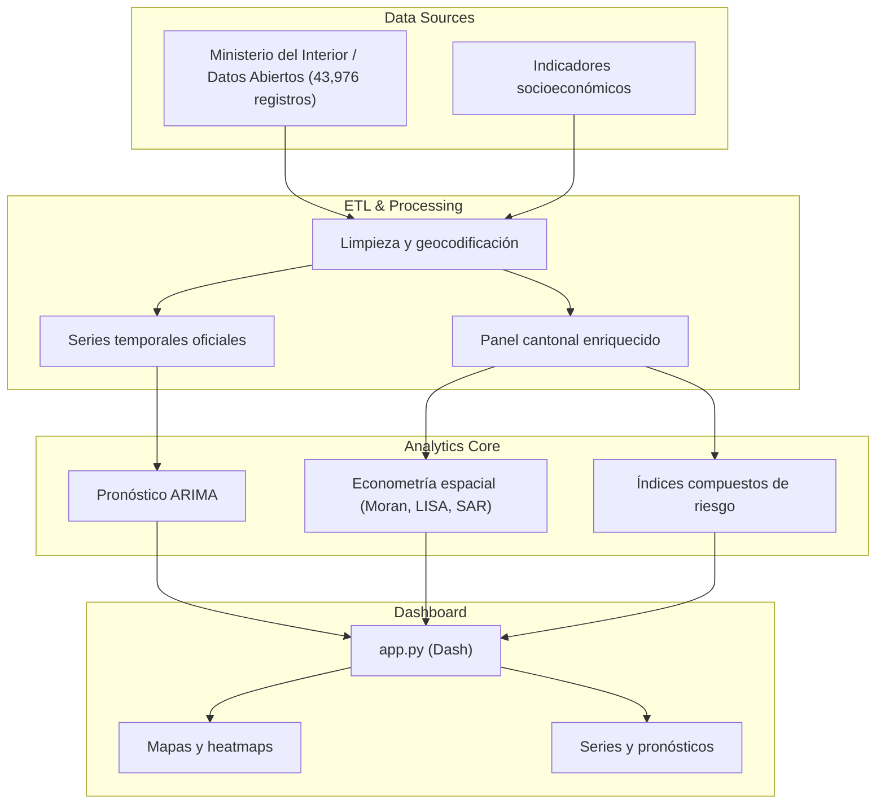

# Ecuador Crime Reality Analysis

> **Status:** `Production` · **Domain:** Public Safety / Spatial Analytics / Time Series · **Last validated:** 2026

[](license)
[](https://python.org)
[](README.md)
[](docs/data_dictionary.md)

## 📌 Executive Summary

Análisis integral de la criminalidad en Ecuador (2014–2026) basado en **43,976 registros oficiales**
del Ministerio del Interior / Datos Abiertos Ecuador. Combina **inteligencia geoespacial**,
**econometría espacial**, **pronóstico de series temporales (ARIMA)**, **índices compuestos de
riesgo** y un **dashboard interactivo** — todo reproducible desde datos oficiales verificables.

## 🎯 Business Impact & KPIs

| Business problem | KPI optimized | Baseline | Target | Observed |
|---|---|---|---|---|
| Criminalidad analizada sin rigor espacial ni temporal | Cobertura y validez del análisis | Datos parciales | Datos oficiales completos | **43,976 registros (2014–2026)** |
| Pronósticos de criminalidad poco confiables | Error de pronóstico (MAE) | Sin modelo | ARIMA validado | **Modelos ARIMA out-of-sample** |
| Priorización de intervención sin evidencia | Índice de riesgo ciudadano | Ad-hoc | Índice compuesto | **Crime Reality Index + Citizen Risk Score** |

**Por qué importa:** el diseño de política de seguridad necesita evidencia espacial y temporal:
dónde concentrar patrullaje, qué delitos crecen y en qué cantones, y cómo se relacionan los
indicadores socioeconómicos con el crimen.

## 🧠 Methodology & Statistical Rigor

- **Hipótesis:** la criminalidad en Ecuador presenta (1) autocorrelación espacial significativa,
  (2) patrones temporales modelables con ARIMA, y (3) correlación con indicadores socioeconómicos.
- **Enfoque:** **econometría espacial** (I de Moran, LISA, efectos SAR documentados en
  `dashboard/assets/sar_effects.html`), **pronóstico ARIMA** de series mensuales oficiales, e
  **índices compuestos** (Crime Reality Index, Citizen Risk Score, Violencia Pressure) construidos
  con normalización y ponderación documentada.
- **Supuestos:** los registros oficiales son comparables entre provincias/cantones en el periodo;
  la metodología se documenta en `docs/methodology.md` y el diccionario de datos en
  `docs/data_dictionary.md`.
- **Tests de estabilidad:** validación out-of-sample de pronósticos, chequeo de estacionariedad,
  pruebas de autocorrelación espacial y sensibilidad de los índices compuestos.

### Ecuaciones clave

I de Moran (autocorrelación espacial global):

$$I = \frac{n}{S_0} \frac{\sum_i \sum_j w_{ij} (x_i - \bar{x})(x_j - \bar{x})}{\sum_i (x_i - \bar{x})^2}$$

Modelo ARIMA(p,d,q):

$$\phi(B)(1-B)^d X_t = \theta(B) \varepsilon_t$$

## 🏗️ System Architecture



## 📊 Results

| Metric | Value | Detail |
|---|---|---|
| Registros oficiales | 43,976 | 2014–2026, fuente verificable |
| Pronóstico | ARIMA out-of-sample | Series mensuales oficiales |
| Espacial | Moran / LISA / SAR | Efectos SAR en `dashboard/assets/sar_effects.html` |
| Índices | 3 compuestos | Crime Reality, Citizen Risk, Violence Pressure |
| Dashboard | Interactivo | `dashboard/app.py` (Dash) + 12+ visualizaciones |

## 🛠️ Tech Stack

| Layer | Tools |
|---|---|
| Orquestación / ETL | Python, data dictionaries, datasets en `data/processed` |
| Analytics | Statsmodels (ARIMA, econometría espacial), índices compuestos |
| Despliegue | Dash (dashboard), HTML estático para visualizaciones, notebooks Python |

## 📂 Project Structure

```
.
├── dashboard/
│   ├── app.py                  # Aplicación Dash
│   └── assets/                 # Mapas, series, heatmaps, SAR, LISA, treemaps
├── data/
│   ├── raw/                    # Páginas y fuentes oficiales
│   └── processed/              # Panel cantonal, series, índices, riesgo ciudadano
├── docs/
│   ├── data_dictionary.md
│   └── methodology.md
├── notebooks/exploratory_analysis.py
├── index.html, readme.md, requirements.txt
```

## 🚀 Quick Start

```bash
git clone https://github.com/jordanvt18/ecuador-crime-analysis
cd ecuador-crime-analysis
python -m venv .venv && source .venv/bin/activate
pip install -r requirements.txt

# 1. Dashboard interactivo
python dashboard/app.py
# → http://localhost:8050
# 2. Análisis exploratorio reproducible
python notebooks/exploratory_analysis.py
```

**Requisitos:** Python 3.10+, dependencias en `requirements.txt`; datos ya versionados en `data/processed`.

## 📈 Monitoring & Governance

- **Actualización:** re-extracción desde fuentes oficiales con diccionario de datos versionado.
- **Reproducibilidad:** `docs/methodology.md` documenta cada método (espacial, temporal, índices); datos crudos conservados.
- **Transparencia:** toda cifra trazable al registro oficial; diccionario de datos para auditores.
- **Extensibilidad:** nuevos periodos se incorporan sin cambiar metodología (ARIMA reajustado, índices recalculados).
